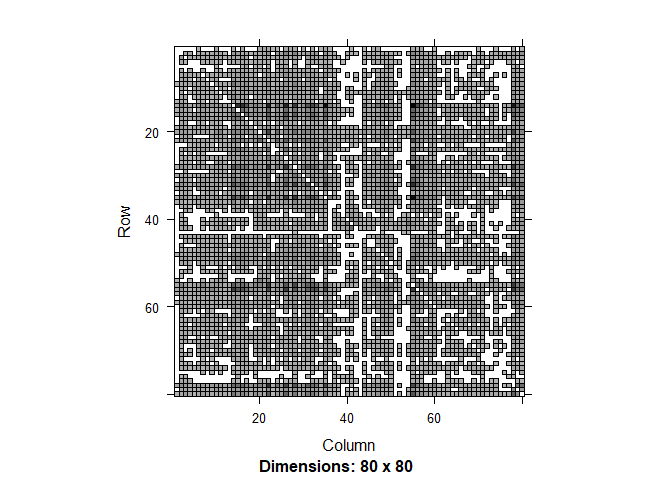
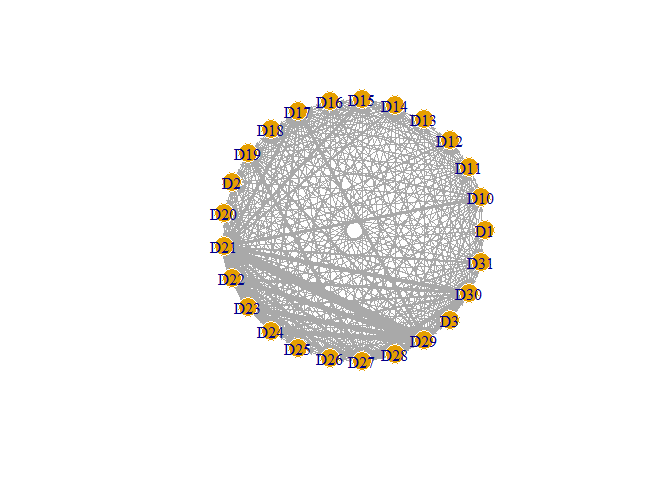
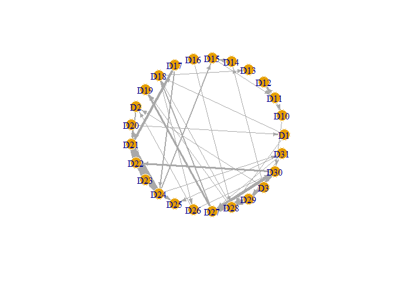
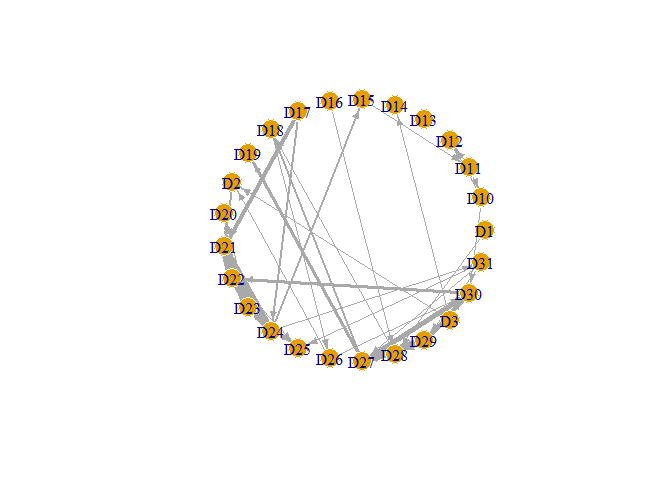
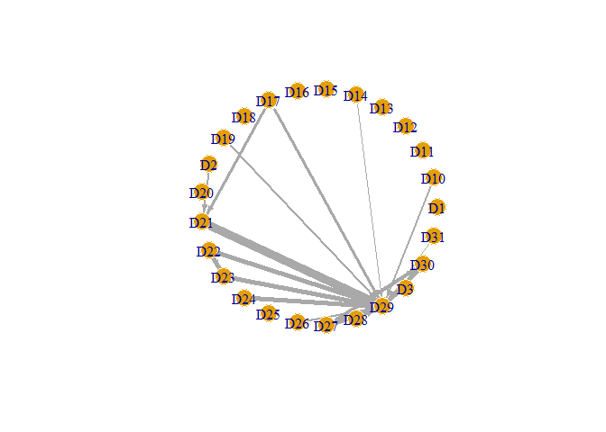

I. Overview
-----------

This package provides tools to contruct disease co-morbidity network based on associative relationships among diseases. There are several different associative measures, including phi-correlation coefficient, observed-to-expected ratio (OER), and disparity filter (others to be added), that can be used to infer the existence of an edge between two diseases. Please refer to (Fotouhi, B., et al. 2018) for more comprehensive review and comparison of different methods. Note that the networks generated by current tools are associative, only informative for the observed pattern of co-morbidity, and might have some predictive ability. They are not suitable for causal interpretation that involves question regarding intervention or counterfactuals.

The sorce code can be found in <https://github.com/dachuwu/comoNet>.

II. Demonstration
-----------------

### (1) Sample dataset

The package provides a sample dataset of the disease records of 3000 individuals. Each row is a visit to hospital and has 1 to 5 disease diagnoses coded by "D10" to "D99".

``` r
#devtools::install_github("dachuwu/comoNet")

library(comoNet)
library(Matrix)
library(igraph)
data(diagnose)
head(diagnose, 10)
```

    ##      ID sex DZ1  DZ2  DZ3  DZ4  DZ5 ageday
    ## 74    1   F D40 <NA> <NA> <NA> <NA>  20467
    ## 146   1   F D40  D41 <NA> <NA> <NA>  21727
    ## 170   1   M D40  D40  D40 <NA> <NA>  22315
    ## 178   1   M D40  D40  D40 <NA> <NA>  22504
    ## 196   1   M D40  D41 <NA> <NA> <NA>  22894
    ## 516   2   M D68  D59 <NA> <NA> <NA>  22922
    ## 710   2   M D34  D34 <NA> <NA> <NA>  26523
    ## 947   3   M D46  D47  D46 <NA> <NA>  10145
    ## 1236  4   F D63  D65  D72 <NA> <NA>  10205
    ## 1401  5   M  D6   D8  D50 <NA> <NA>  19665

### (2) Convert to individual progression sequence

``` r
ipseq <- get_ipseq(df = diagnose, 
                   var_id = "ID", var_t = "ageday", 
                   var_dz = c("DZ1","DZ2","DZ3","DZ4","DZ5"))
ipseq[1:3]
```

    ## $`1`
    ##       t  dz
    ## 1 20467 D40
    ## 2 21727 D41
    ## 
    ## $`2`
    ##       t  dz
    ## 1 22922 D68
    ## 2 22922 D59
    ## 3 26523 D34
    ## 
    ## $`3`
    ##       t  dz
    ## 1 10145 D46
    ## 2 10145 D47

### (3) Build raw comorbidity network

``` r
dzLevel <- sort(unique(
  c(diagnose$DZ1, diagnose$DZ2, diagnose$DZ3, diagnose$DZ4, diagnose$DZ5)
))
res <- comoNet_from_prog_sp(ipseq = ipseq, dz.lv = dzLevel, bidir = F, conditional = F)
```

    ## 
    ##  ipseq structure checked.

``` r
raw_net <- res[[1]]
image(raw_net)
```



``` r
sub_net <- raw_net[1:25,1:25]
g0 <- graph_from_adjacency_matrix(sub_net, mode="directed", weighted = T)
g0 <- set_vertex_attr(g0, "label", value = dzLevel[V(g0)])
E(g0)$width <- 10*E(g0)$weight/max(E(g0)$weight)

plot(g0, layout=layout_in_circle, edge.arrow.size=.2, vertex.frame.color="white")
```



### (4) Filter out insignificant links

Since the raw comorbidity network contains all disease progression links regardless of statistical significance, we need to apply filters to obtaing the significant backbones of the comorbidity network. Currently there are three methods included, using different associative measure.

#### By observed-to-expected (OER) measure

``` r
res <- filter_OER(as.matrix(raw_net),sig_lv = 0.05)
OER_net <- res$A_filtered
sub_net <- OER_net[1:25,1:25]

g1 <- graph_from_adjacency_matrix(sub_net, mode="directed", weighted = T)
g1 <- set_vertex_attr(g1, "label", value = dzLevel[V(g1)])
E(g1)$width <- 10*E(g1)$weight/max(E(g1)$weight)

plot(g1, layout=layout_in_circle, edge.arrow.size=.5, vertex.frame.color="white")
```



#### By phi-correlation measure

``` r
res <- filter_phi(as.matrix(raw_net),sig_lv = 0.05)
OER_net <- res$A_filtered
sub_net <- OER_net[1:25,1:25]

g1 <- graph_from_adjacency_matrix(sub_net, mode="directed", weighted = T)
g1 <- set_vertex_attr(g1, "label", value = dzLevel[V(g1)])
E(g1)$width <- 10*E(g1)$weight/max(E(g1)$weight)

plot(g1, layout=layout_in_circle, edge.arrow.size=.5, vertex.frame.color="white")
```



#### By disparity filter

``` r
res <- filter_dispar(as.matrix(raw_net),sig_lv = 0.05)
OER_net <- res$A_filtered
sub_net <- OER_net[1:25,1:25]

g1 <- graph_from_adjacency_matrix(sub_net, mode="directed", weighted = T)
g1 <- set_vertex_attr(g1, "label", value = dzLevel[V(g1)])
E(g1)$width <- 10*E(g1)$weight/max(E(g1)$weight)

plot(g1, layout=layout_in_circle, edge.arrow.size=.5, vertex.frame.color="white")
```



III. References
---------------

Fotouhi, B., Momeni, N., Riolo, M. A., & Buckeridge, D. L. (2018). Statistical methods for constructing disease comorbidity networks from longitudinal inpatient data. Applied network science, 3(1), 46.

Hidalgo, C. A., Blumm, N., Barabasi, A. L., & Christakis, N. A. (2009). A dynamic network approach for the study of human phenotypes. PLoS computational biology, 5(4), e1000353.

Serrano, M. a., Boguna, M., & Vespignani, A. (2009). Extracting the multiscale backbone of complex weighted networks. Proceedings of the national academy of sciences, 106(16), 6483-6488.
